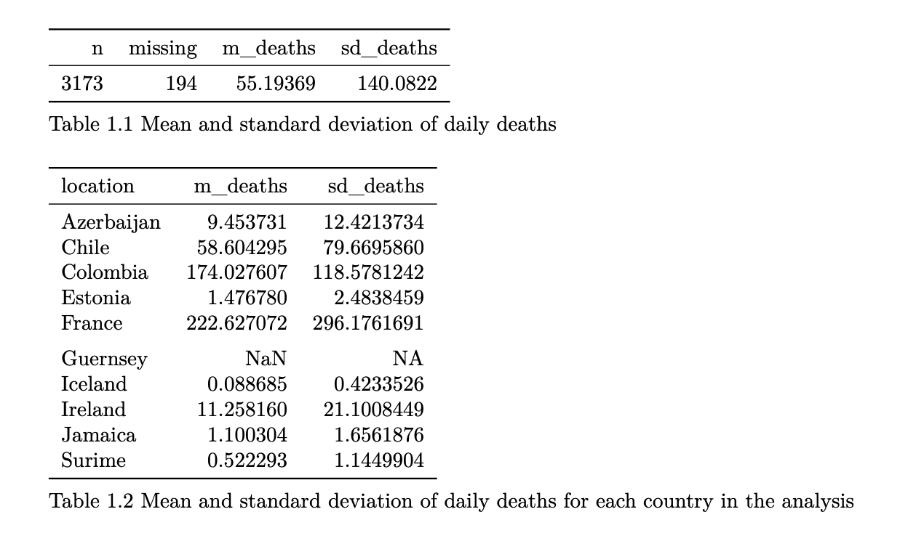

# COVID-19 Data Analysis — Linear Regression Project

### Author
**Eoghan Kealy**  
R Programming - Dublin City University project

---

## 📘 Project Overview
This project analyzes COVID-19 data to explore the relationship between **test positivity rates**, **extreme poverty**, and **daily new deaths**.  
A linear regression model with an **interaction term** is used to test whether poverty modifies the effect of test positivity on COVID-19 mortality.

---

## 📊 Data
**File:** `data/nphet_data_merged.csv`  
**Source:** NPET (National Public Health Emergency Team) COVID-19 dataset (merged and cleaned)

**Key Variables**
- `new_deaths` — Daily new reported COVID-19 deaths  
- `positive_rate` — Proportion of tests returning positive  
- `extreme_poverty` — Percentage of the population living in extreme poverty  
- `location` — Country or region identifier  

---

## ⚙️ Methods
1. **Data Cleaning:** Handle missing values and convert variables to numeric form.  
2. **Exploratory Analysis:** Summarize variables and visualize relationships.  
3. **Linear Regression Model:**  
   ```r
   lm(new_deaths ~ positive_rate * extreme_poverty, data = nphet_data_merged)
   ```
   This tests both the main effects and their interaction.  
4. **Diagnostics:** Residual plots, Breusch–Pagan test, and multicollinearity (VIF).  
5. **Interpretation:** The interaction term indicates whether poverty strengthens or weakens the link between test positivity and deaths.



---

## 🧠 Key Findings
- Higher positivity rates are associated with more COVID-19 deaths.  
- The relationship between positivity and deaths becomes stronger in countries with higher extreme poverty.  


---
